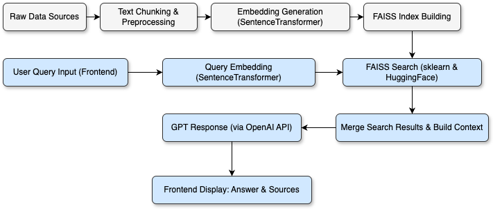
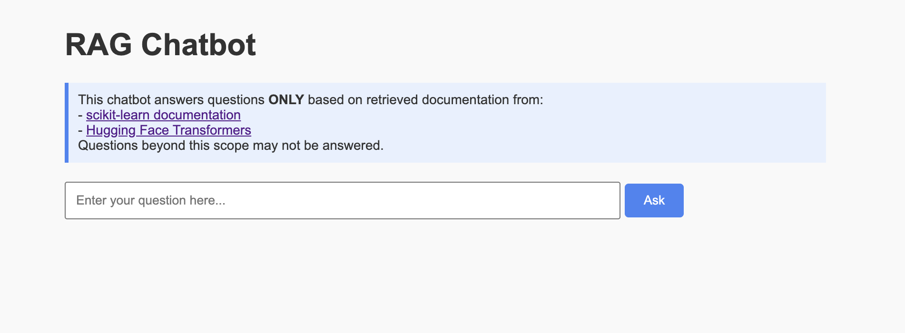
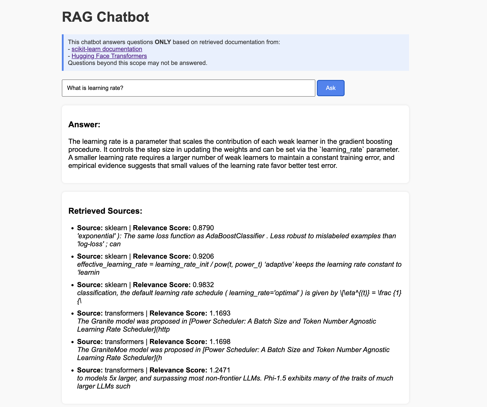

## RAG-Augmented Chatbot

### Project Introduction
A lightweight RAG chatbot based on FAISS local retrieval and OpenAI Chat API. It can answer user questions by retrieving content from HuggingFace and scikit-learn official documentation, combining the context, and generating accurate answers using GPT models.

> Default model is GPT-3.5-Turbo. You can modify `query.py` to change to any OpenAI-supported model (e.g., GPT-4).

---

### System Architecture



---

### Live Demo (currently disabled due to OpenAI API misuse concerns)

You can try the chatbot live on Hugging Face Spaces:

[](https://huggingface.co/spaces/Daniel192341/RAG-Augmented-chatbot-hfspace)


> This Hugging Face Space is a Gradio-based lightweight deployment for demo purposes.  
> The complete frontend + Docker version is available in this main repository.

You can also check out the Hugging Face Space source code here:  
[Hugging Face Space GitHub Repository](https://github.com/Arsney091289421/RAG-Augmented-chatbot-hfspace)

---

### Demo Screenshots

**Homepage**  


**Example Q&A**  


---

### Demo Video (using Docker Compose)

You can preview the demonstration video here:

[](https://youtu.be/CqDA03Q3pow)

---

### Tech Stack
- Python
- FAISS
- Sentence-Transformers
- OpenAI Chat API
- Flask
- Docker deployment

---

### Features
- Precomputed document embeddings (stored locally in npy + json + faiss index files)
- Multi-source document retrieval (HuggingFace & Scikit-learn)
- Similarity scoring and context combination
- Answer generation via GPT model
- Simple frontend to display answers, sources, and relevance scores

---

## Local Setup
### 1. Clone the repository
```bash
git clone https://github.com/Arsney091289421/RAG-Augmented-chatbot.git
cd RAG-Augmented-chatbot
```

### 2. Install dependencies
```bash
pip install -r requirements.txt
```

### 3. Set environment variables
Copy the example file and create your own `.env`:
```bash
cp .env.example .env
```
Then edit `.env` and add your OpenAI API Key:
```
OPENAI_API_KEY=your_openai_api_key_here
```

### 4. Run the app locally
```bash
python app.py
```
Visit [http://localhost:5050](http://localhost:5050) in your browser.

---

## Docker Deployment (Option 1 — manual run)
```bash
docker build -t rag-chatbot .
docker run -e PORT=5050 -p 5050:5050 --env-file .env rag-chatbot
```
> You can change the external port if needed.  
Example:
```bash
docker run -e PORT=5050 -p 8080:5050 --env-file .env rag-chatbot
```
Then open [http://localhost:8080](http://localhost:8080)

---

## Docker Deployment (Option 2 — using Docker Compose)
```bash
docker-compose up --build
```
By default, it will run on [http://localhost:5050](http://localhost:5050).  
Make sure to have your `.env` file ready in the project root.

---

### Tip:
After the initial build, you don't need to rebuild every time.
You can simply start the container in detached mode by running:
```bash
docker-compose up
```
This will use the existing build and run in the background.

---

## Configuration

The chatbot’s behavior can be customized via the `config.json` file located in the project root.  
No need to modify `query.py` directly — parameters are read automatically from `config.json`.

### Adjustable parameters:
| Parameter      | Description                                                 | Recommended value         |
|----------------|-------------------------------------------------------------|---------------------------|
| `model_name`   | The GPT model used for answering (e.g., `gpt-3.5-turbo`)     | `gpt-3.5-turbo` or `gpt-4`|
| `temperature`  | Controls randomness of responses; lower = more deterministic | 0.0 – 0.4 (default: 0.3)  |
| `top_k`        | Number of documents retrieved for context                   | 3 – 5 (default: 3)        |

### Example `config.json`
```json
{
  "model_name": "gpt-3.5-turbo",
  "temperature": 0.3,
  "top_k": 3
}
```

**When running via Docker Compose, `config.json` is mounted into the container via volumes.**  
If you change `config.json`, simply run:

```bash
docker-compose restart
```

This will apply new parameters without rebuilding the image.

## Contact
- GitHub: [https://github.com/Arsney091289421](https://github.com/Arsney091289421)

